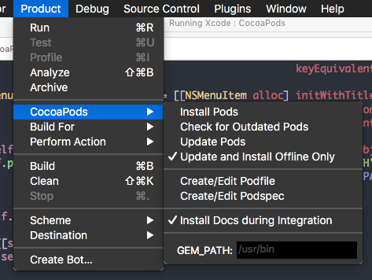
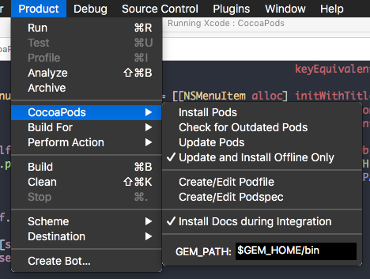

# CocoaPods for Xcode


This project is deprecated in favor of [Editor Extensions](https://developer.apple.com/videos/play/wwdc2016/414/) support in Xcode 8+.

Manage your dependencies, with minimal command line hack-fu.

## Features

- Downloads and integrates CocoaPods listed in a project's Podfile
- Creates podspecs from a template
- Shows command output in the window console
- Installs documentation (from CocoaDocs) for the CocoaPods used in the open Xcode workspace
- Supports using a custom path to your CocoaPods installation
- Supports `$GEM_HOME` expansion, `$GEM_PATH` expansion, and `rvm` environments
- Offline mode




## Prerequisites

- Xcode 5+
- CocoaPods 0.22.1+, by default expected to be installed to `/usr/bin/pod`. The installation path can be changed by editing `GEM PATH` in the `Product > CocoaPods` menu. More details can be found in the Usage section.


## Install

Install via [Alcatraz](http://alcatraz.io/)

OR

Clone and build the project, then restart Xcode.

## Uninstall

Uninstall via [Alcatraz](http://alcatraz.io/)

OR

Run `rm -r ~/Library/Application\ Support/Developer/Shared/Xcode/Plug-ins/CocoaPods.xcplugin/`

## Usage

### Offline mode

In some situations, such as working under poor network conditions, you may want to run `pod` in
offline mode. Toggle `Product > CocoaPods > Update and Install Offline Only` to enable offline mode.

### Custom GEM_PATH setting

You can specify a custom GEM_PATH in the `Product > Cocoapods` menu. The default is `/usr/bin` and removing a custom value will restore the default. Both `$GEM_HOME` and `$GEM_PATH` are supported, along with `rvm` environments. That means the following settings are valid:

```
  /usr/bin
  /usr/local/bin
  $GEM_HOME/bin
  ${GEM_HOME}/bin
  $GEM_PATH/bin
  ${GEM_PATH}/bin
  /SOME_PARENT/$GEM_HOME/bin
  /SOME_PARENT/$GEM_PATH/bin
```

When specifying `$GEM_PATH` each path component will be expanded during command resolution. That means the following:

```
  $GEM_PATH/bin
  expands to...
  /Users/jappleseed/.rvm/gems/ruby-2.0.0-p247@my_gemset:/Users/jappleseed/.rvm/gems/ruby-2.0.0-p247@global
  expands to...
  /Users/jappleseed/.rvm/gems/ruby-2.0.0-p247@my_gemset/bin:/Users/jappleseed/.rvm/gems/ruby-2.0.0-p247@global/bin
```

During command resolution, each path will be tested (in order) so that the first match is used.

Path expansion and command resolution occurs each time before a command is run. For an `rvm` environment, `.ruby-version` and `.ruby-gemset` (in the root project directory) can dynamically alter the environment and Cocoapods supports this behavior.

#### Using GEM_PATH with rvm

Under most circumstances in an `rvm` environment the following custom `GEM_PATH` setting should be used:



NOTE: Behind the scenes, the `/bin` path element will be converted to `/wrapper` for rvm. If `.rvm` is not found in the expanded path, the `/bin` path element will remain unmodified.

## [Contributors](https://github.com/kattrali/cocoapods-xcode-plugin/graphs/contributors)

## License

**cocoapods-xcode-plugin** is [licensed under the MIT open source license](https://github.com/kattrali/cocoapods-xcode-plugin/blob/master/LICENSE).
